.. 操作マニュアル documentation master file, created by
   sphinx-quickstart on 2024.2.22.
   You can adapt this file completely to your liking, but it should at least
   contain the root `toctree` directive.

操作マニュアル
===================================================================================

.. toctree::
   :maxdepth: 3
   :caption: Contents:

.. _cluseter_vm:

概要
===================================================================================

クラスタパックはユーザーに対してmdx環境におけるクラスタ環境構築の手順を提供します。

クラスタパックはLDAP, NFS, SLURMから構成されており、LDAPによるユーザー情報管理、
NFSによるファイル共有、SLURMによるジョブ管理を行うことができます。

.. image :: img/cluster_summary.png

本書では、クラスタパックの環境構築（LDAP, NFS, SLURMそれぞれの環境構築の方法）および
操作方法（LDAPでのユーザー追加方法およびSLURMによるジョブ投入方法）について記載しています。

環境構築について
===================================================================================

コントロールノード、計算ノードに用いるマシンについて
---------------------------------------------------------------

ここでは、コントロールノード、計算ノードに用いるマシン情報を記載します。
実際の構築環境に合わせてマシン名やIPアドレスを変更してください。

**コントロールノード（LDAPサーバー兼NFSサーバー兼SLURMコントロールノード）**
  
- マシン名: ubuntu-2204
- IP: 10.5.4.45
- グローバルIP: 163.220.177.146

**計算ノード（LDAPクライアント兼NFSクライアント兼SLURM計算ノード）**

- マシン名: ubuntu-2204-test
- IP: 10.5.0.121

インストールするパッケージ
---------------------------------------------------------------

クラスタパックにおいては、コントロールノードに下記のLDAP-server, NFS-server, SLURMに
記載されたパッケージをインストールし、計算ノードに下記のLDAP-client, NFS-client, SLURM
に記載されたパッケージをインストールします。

**LDAP-server**

- slapd
- ldap-utils
- ldap-account-manager
- libnss-ldapd
- libpam-ldapd

**LDAP-client**

- libnss-ldapd
- libpam-ldapd

**nfs-server**

- nfs-kernel-server

**nfs-client**

- nfs-common

**slurm**

- slurm-wlm
- munge
- libmunge2
- libmunge-dev

コントロールノードでのソフトウェアインストール
~~~~~~~~~~~~~~~~~~~~~~~~~~~~~~~~~~~~~~~~~~~~~~~~~~~~~~~~~~~~~~~

まず、LDAPを導入します。下記のコマンドを実行してください。

.. code-block:: bash

   sudo apt update
   sudo apt install -y slapd ldap-utils 
   
ldap-utilsのインストール時に、LDAPサーバーの管理者パスワード設定画面が出るので設定します。

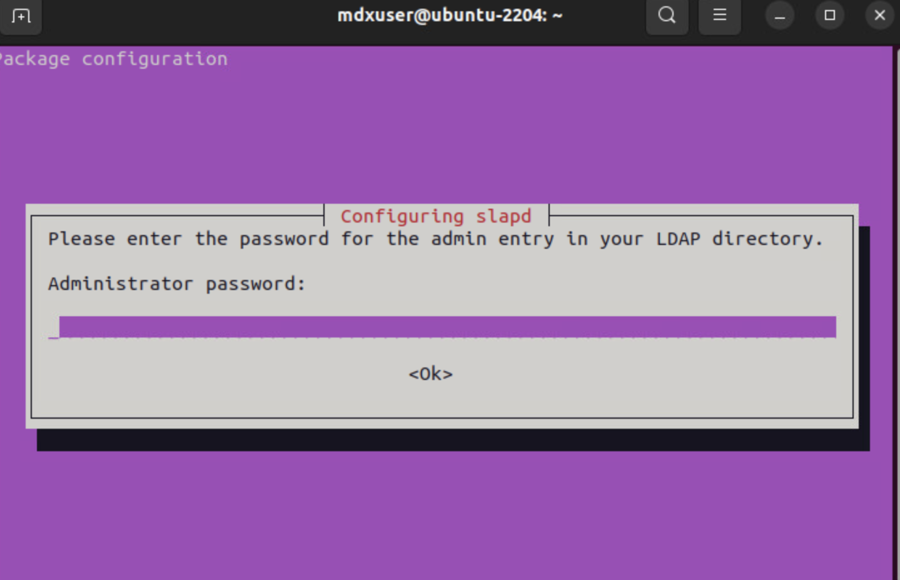

次にベースDNを確認します。

.. code-block:: bash

   sudo slapcat

上記コマンドを実行すると、下記のような出力が得られます。

.. code-block:: none

   dn: dc=nodoman
   objectClass: top
   objectClass: dcObject
   objectClass: organization
   o: nodomain
   dc: nodomain
   structuralObjectClass: organization
   entryUUID: b676e8b0-6e46-103e-9a07-89959c6e3f37
   creatorsName: cn=admin,ac=nodomaln
   createTimestamp: 20240304074401Z
   entryCSN: 20240304074401.907263Z#000000#000#000000
   modifiersName: cn=admin,dc=nodomain
   modifyTimestamp: 20240304074401Z

ベースDNがnodomainとなっているので、Slapdを設定します。

.. code-block:: bash

   sudo dpkg-reconfigure slapd

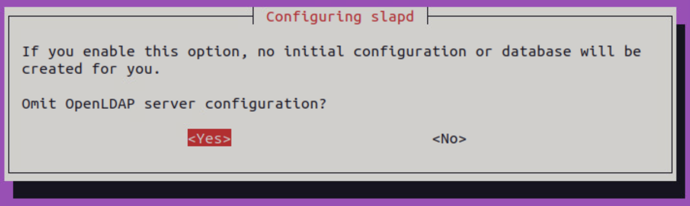

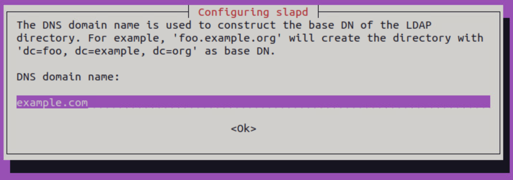

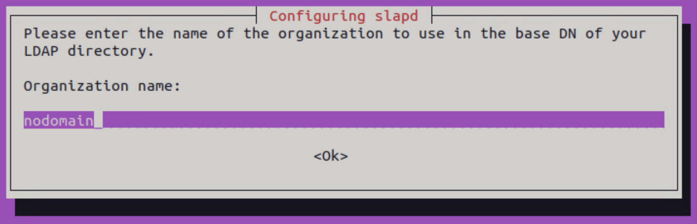

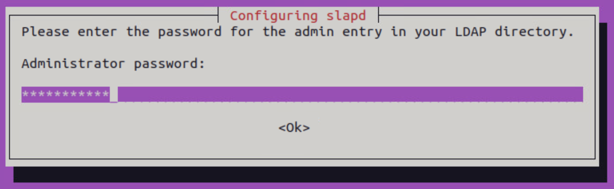

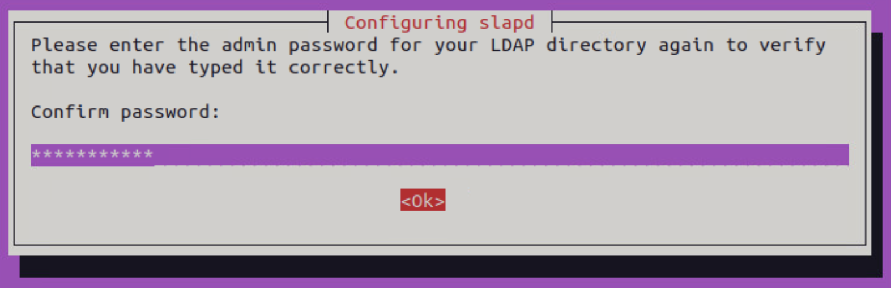

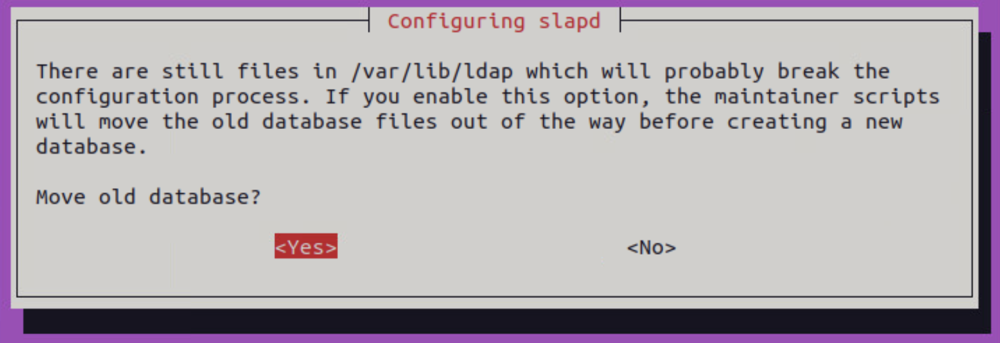

ここで設定したベースDN、パスワードは覚えておいてください。

次に、ldap-account-managerを導入します。下記のコマンドを実行してください。

.. code-block:: bash

   sudo apt install -y ldap-account-manager

次にOpenLDAPクライアントの設定を行います。下記のコマンドを実行してください。

.. code-block:: bash

   sudo apt install -y libnss-ldapd libpam-ldapd

インストール時にNSSの設定画面が出るので設定していきます。

OpenLDAPサーバーのURI(IPアドレス)を入力します。
コントロールノードですので、127.0.0.1を入力してください。

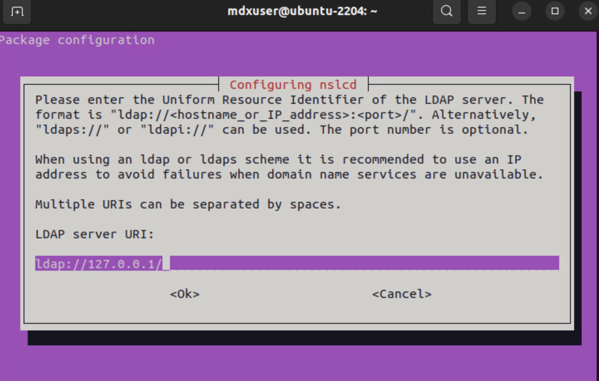

次に、ベースDNを入力します。

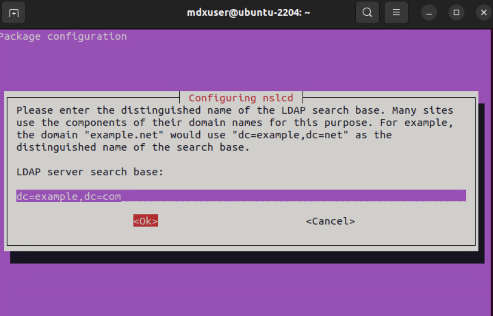

同期させるパッケージを選択します。
ここではユーザー、グループ、パスワード情報を同期させたいので
passwd、group、shadowをスペースキーで選択してください。

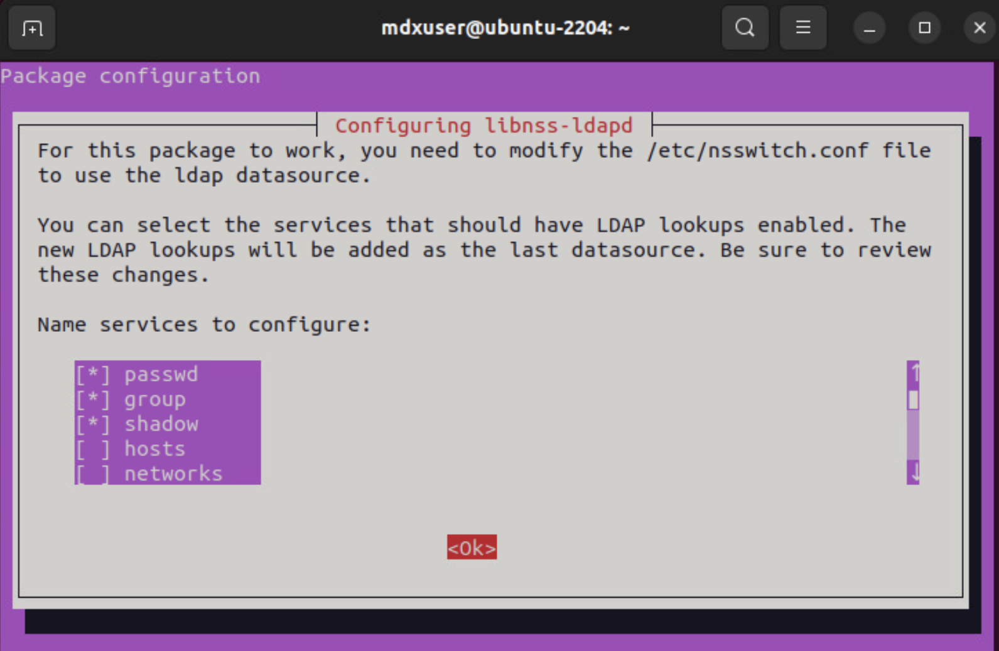

つづいて、NFS、SLURMを導入します。下記のコマンドを実行してください。

.. code-block:: bash

   sudo apt install -y nfs-kernel-server slurm-wlm munge libmunge2 libmunge-dev

以上で、コントロールノードのインストールは完了です。

計算ノードでのソフトウェアインストール
~~~~~~~~~~~~~~~~~~~~~~~~~~~~~~~~~~~~~~~~~~~~~~~~~~~~~~~~~~~~~~~

まず、OpenLDAPクライアントの設定を行います。下記のコマンドを実行してください。

.. code-block:: bash

   sudo apt update
   sudo apt install -y libnss-ldapd libpam-ldapd

設定方法については、コントロールノードに記載したものと概ね同じです。
OpenLDAPサーバーのURI(IPアドレス)については、コントロールノードのIPアドレスを入力してください。
（ここの例では、10.5.4.45）

つづいて、NFS、SLURMを導入します。下記のコマンドを実行してください。

.. code-block:: bash

   sudo apt install -y nfs-common slurm-wlm munge libmunge2 libmunge-dev

以上で、計算ノードのインストールは完了です。

設定について
---------------------------------------------------------------

Ansibleのインベントリファイルの準備
~~~~~~~~~~~~~~~~~~~~~~~~~~~~~~~~~~~~~~~~~~~~~~~~~~~~~~~~~~~~~~~

ここでは、Ansibleを用いて設定を行うので、
cluster-settingディレクトリにあるcluster.iniを
お使いの環境に合わせて編集してください。
ここには、コントロールノード、計算ノードのIPおよびホスト名の情報を記載します。

.. code-block:: none

   [control_nodes]
   ubntu-2204 ansible_host=10.5.4.45

   [compute_nodes]
   ubuntu-2204-test ansible_host=10.5.0.121

cluster-settingディレクトリはcluster.ini以外に下記のファイルを含みます。

* add-ldapPublicKey-schema.ldif: LDAPにSSHキーを追加するためのスキーマファイル
* hosts.j2: /etc/hostsに追加する情報のテンプレート
* ldapAuthSSH.sh.j2: LDAPにSSHキーを追加するためのスクリプトのテンプレート
* ldap-ssh.yml: LDAPにSSHキーを追加するためのPlaybook
* nfs.yml: NFSの設定用Playbook
* slurm.conf: SLURMの設定ファイル
* slurm.yml: SLURMの設定用Playbook

LDAP
~~~~~~~~~~~~~~~~~~~~~~~~~~~~~~~~~~~~~~~~~~~~~~~~~~~~~~~~~~~~~~~

コントロールノードにてLAMを用いて設定を行います。
http://localhost/lam/ にアクセスし、LAMの設定を行います。

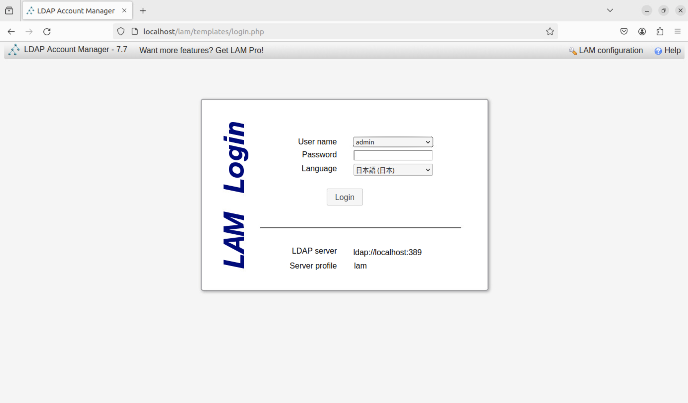

右上の「LAM configuration」をクリック、続いて「Edit server profiles」をクリックします。

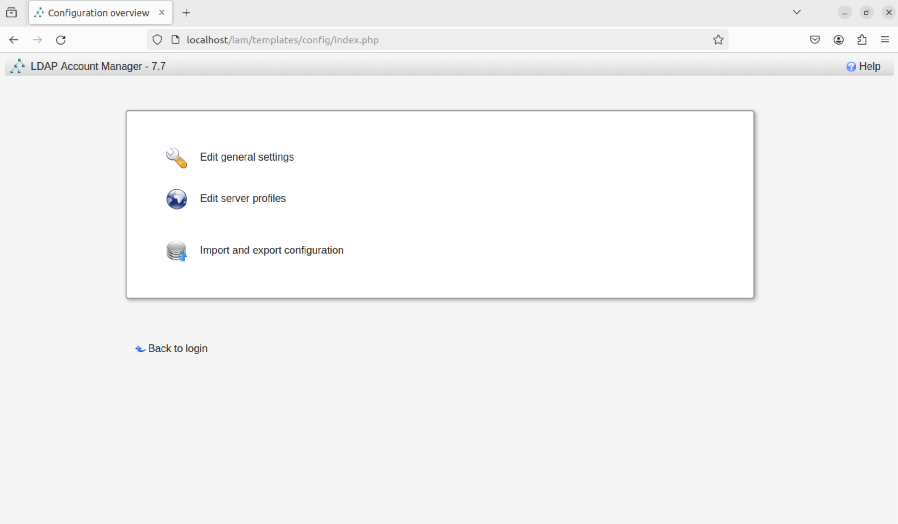

初期パスワードlamを入力し、「OK」をクリックします。

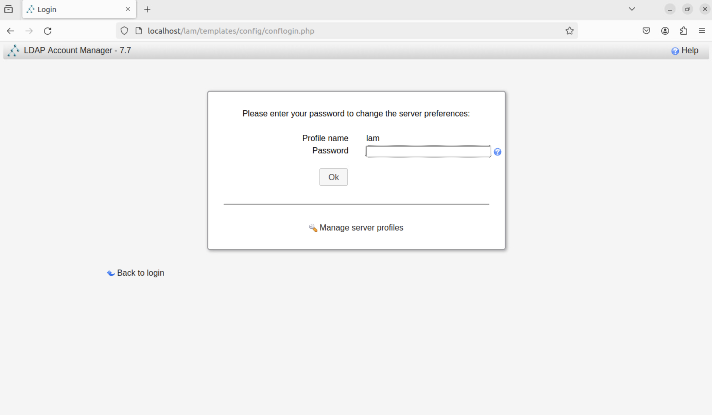

「Tool settings」内の「Tree suffix」と「Security settings」内の
「List of valid users」を設定した情報に合わせて変更してください。

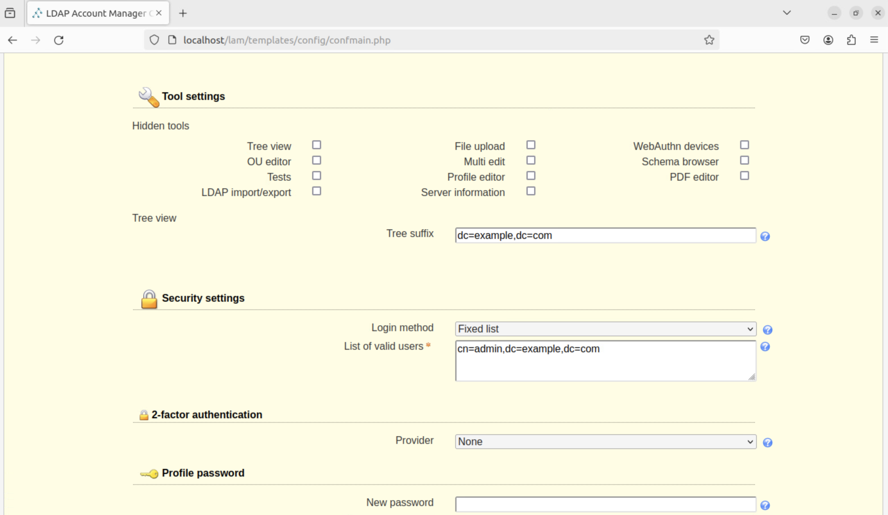

また、「Account types」内の「Active account types」のdcを書き換えてください。

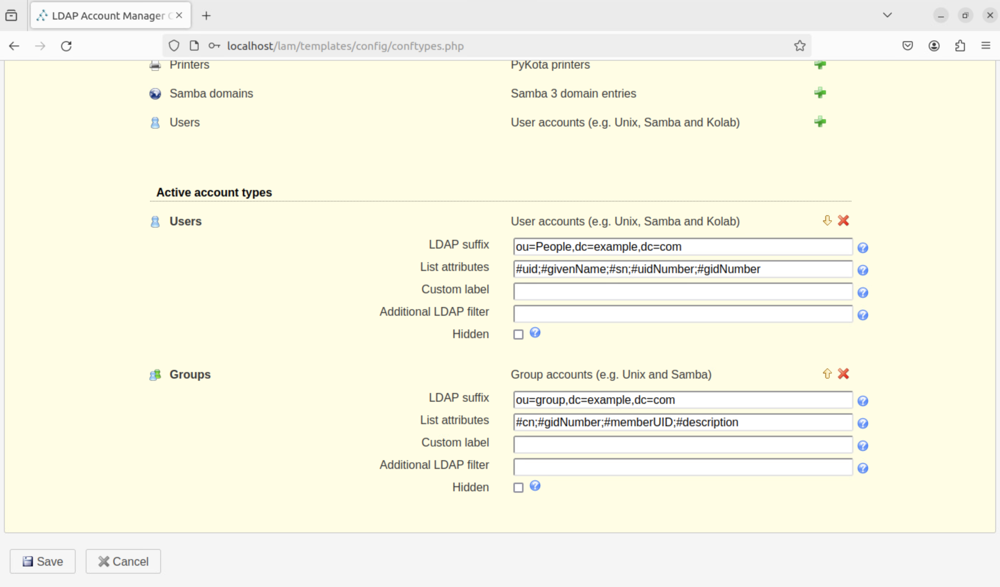

ログイン画面に戻り、初期設定時に設定したパスワードでログインしてください。

初期グループを作成します。「Create」をクリックしてください。

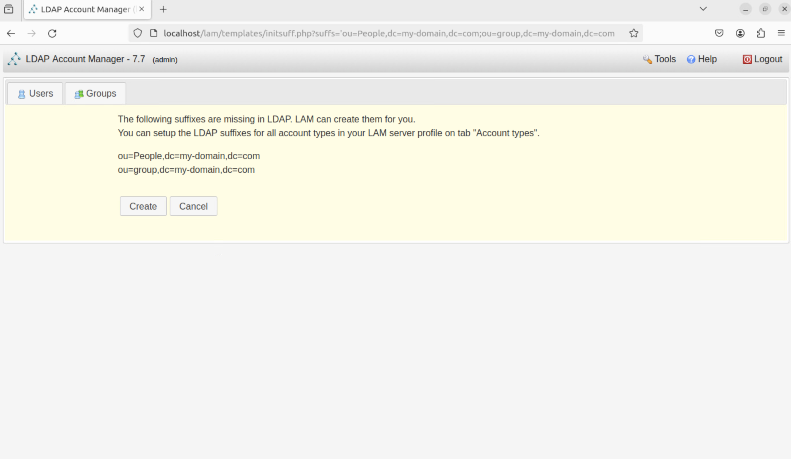

成功すれば、下記のような画面が表示されます。

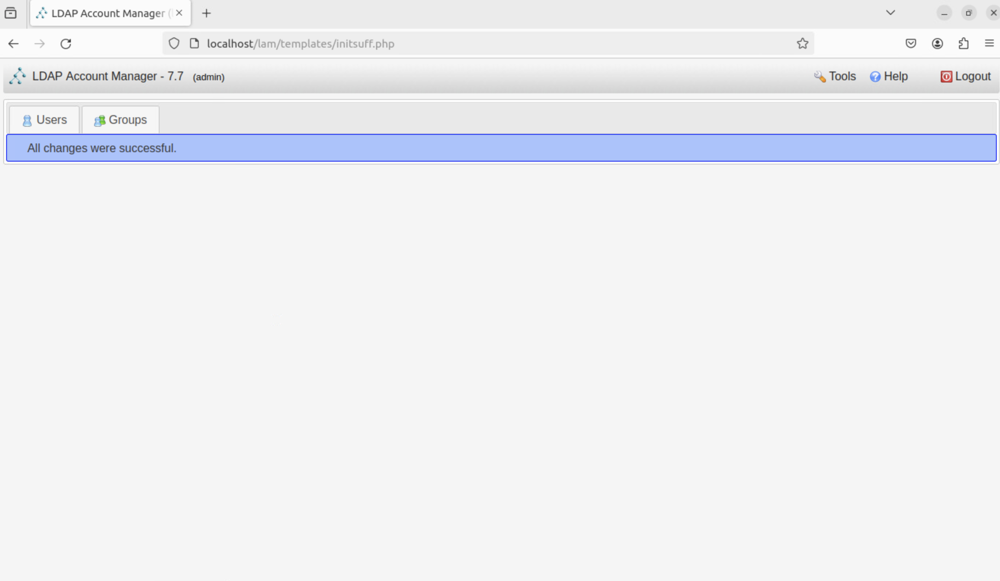

次に、LDAPからSSHキーを追加出来るようにします。

cluster-setting内の設定ファイルldap-ssh.ymlを用いればこの設定を行うことができます。

.. code-block:: bash

   ansible-playbook -i cluster.ini ldap-ssh.yml

上記の後、LAMの設定画面からSSHキーを追加できるように設定します。

「LAM configuration」から「Edit server profiles」を選択してログインしてください。
その後、Modulesのタブを選択し、UsersのAvailable modulesにある「SSH public key」を
選択後、画面下にある「Save」ボタンをクリックしてください。

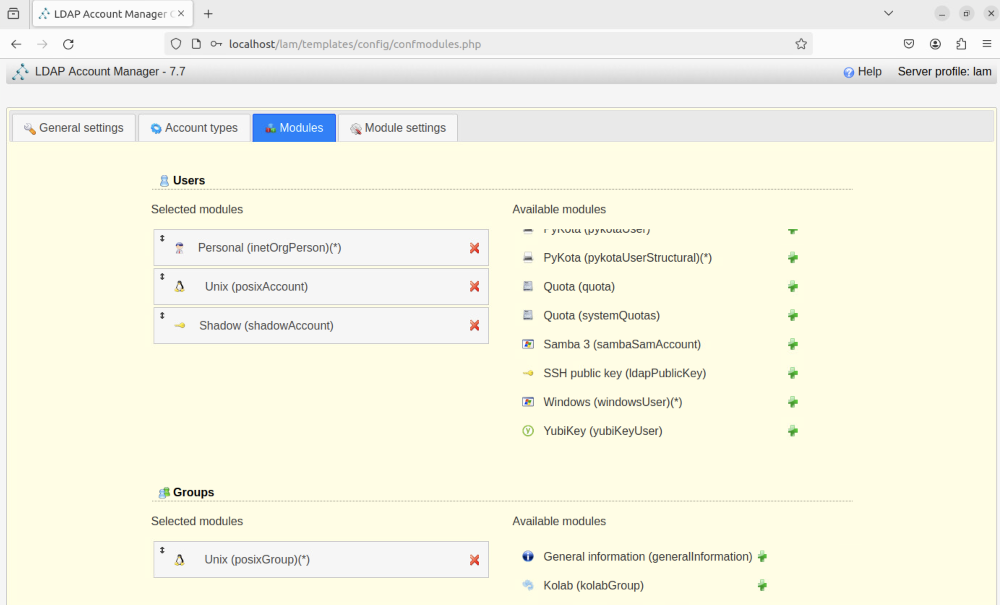

これで、LAMからSSHキーを追加できるようになりました。

NFS
~~~~~~~~~~~~~~~~~~~~~~~~~~~~~~~~~~~~~~~~~~~~~~~~~~~~~~~~~~~~~~~

cluster-setting内の設定ファイルnfs.ymlを用いる事で、
サーバー側とクライアント側の設定を一括で行うことができます。

下記のコマンドを実行してください。

.. code-block:: bash

   ansible-playbook -i cluster.ini nfs.yml

SLURM
~~~~~~~~~~~~~~~~~~~~~~~~~~~~~~~~~~~~~~~~~~~~~~~~~~~~~~~~~~~~~~~

SLURMの設定についても、cluster-setting内の設定ファイルslurm.ymlを用いる事で、
コントロールノード、計算ノードの設定を一括で行うことができます。
ただし、SLURMではslurm.confという設定ファイルを作成する必要があります。

cluster-setting内のslurm.confをお使いの環境に合わせて編集してください。
主に、ControlMachine, やCOMPUTE NODESの設定を変更してください。

.. code-block:: none

   # slurm.conf file generated by configurator.html
   # Put this file on all nodes of your cluster.
   # See the slurm.conf man page for more information.
   #
   ControlMachine=ubuntu-2204
   # ControlAddr=
   # BackupController=
   # BackupAddr=
   AuthType=auth/munge
   #CacheGroups=0
   CryptoType=crypto/munge
   MpiDefault=none
   ProctrackType=proctrack/pgid
   ReturnToService=2
   SlurmctldPidFile=/var/run/slurmctld.pid
   SlurmctldPort=6817
   SlurmdPidFile=/var/run/slurmd.pid
   SlurmdPort=6818
   SlurmdSpoolDir=/var/spool/slurmd
   SlurmUser=slurm
   StateSaveLocation=/var/spool/slurmctld
   SwitchType=switch/none
   TaskPlugin=task/affinity
   #
   #
   # TIMERS
   # KillWait=30
   # MinJobAge=300
   # SlurmctldTimeout=120
   # SlurmdTimeout=300
   #
   #
   # SCHEDULING
   SchedulerType=sched/backfill
   SelectType=select/cons_res
   SelectTypeParameters=CR_Core
   #
   #
   # LOGGING AND ACCOUNTING
   AccountingStorageType=accounting_storage/none
   ClusterName=cluster
   JobCompType=jobcomp/none
   JobAcctGatherType=jobacct_gather/none
   SlurmctldDebug=info
   SlurmctldLogFile=/var/log/slurm/slurmctld.log
   #
   #
   # COMPUTE NODES
   NodeName=ubuntu-2204-test CPUs=3 State=UNKNOWN
   PartitionName=debug Nodes=ubuntu-2204-test Default=YES MaxTime=INFINITE State=UP

設定が完了したら、下記のコマンドを実行してください。

.. code-block:: bash

   ansible-playbook -i cluster.ini slurm.yml

操作方法について
===================================================================================

LDAPでのユーザー追加方法
---------------------------------------------------------------

コントロールノードにてLAMを用いてユーザーを追加します。
http://localhost/lam/ にアクセスし、ログインしてください。

まずGroupのタブをクリックしてグループを追加します

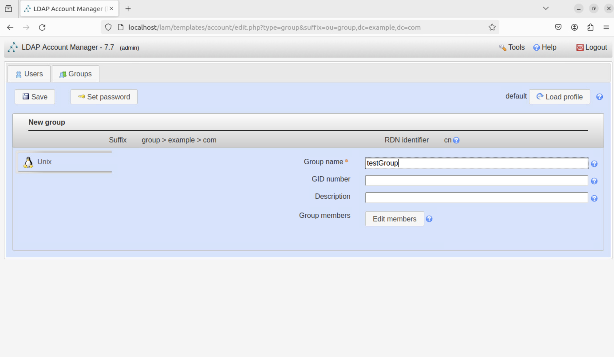

続いて、Userのタブをクリックしてユーザーを追加します。
各タブに必要事項を入力し、「Save」をクリックしてください。

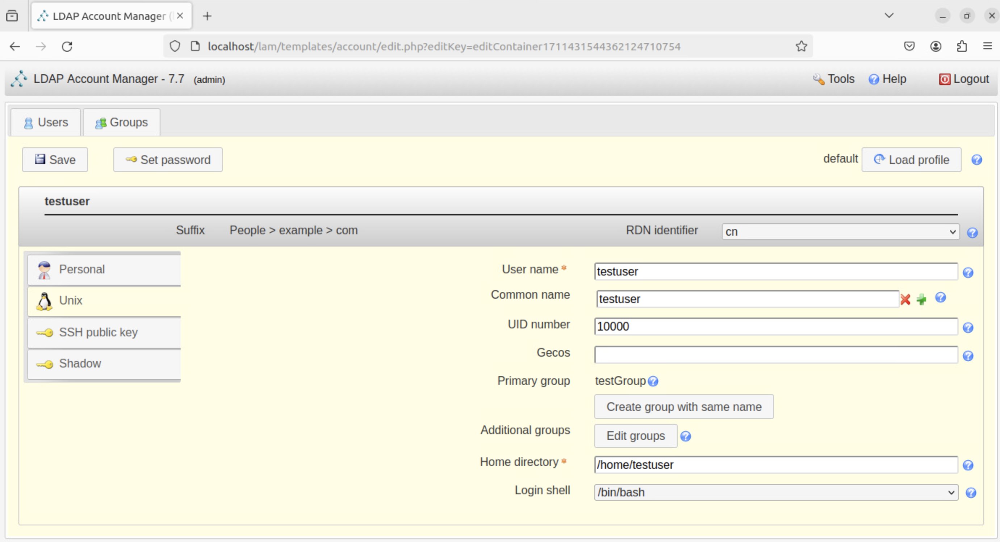

ここで、ユーザーの追加と同時にSSHキーを追加する事も可能です。
SSHキーを追加する場合は、「SSH public key」タブを選択します。

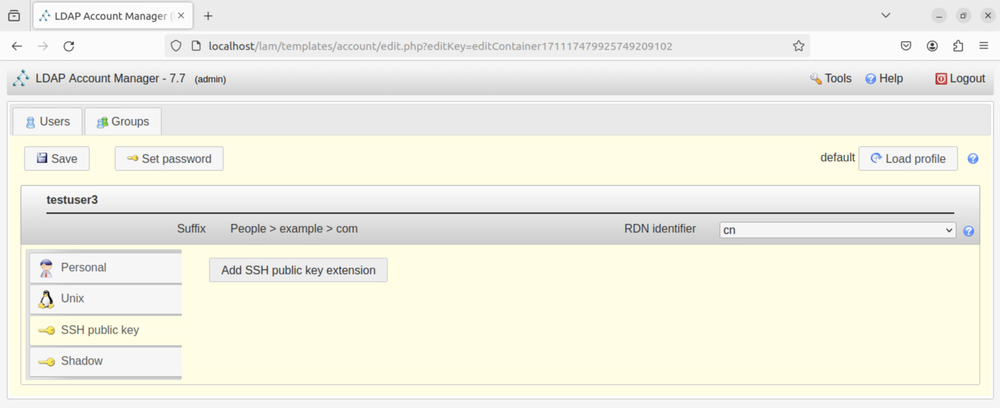

こちらの画面で「Add SSH public key extention」ボタンをクリックすると、
下記のような画面が表示されます。

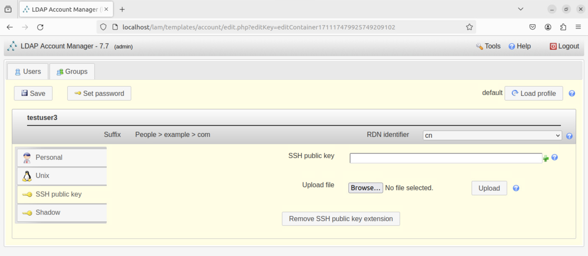

ここで、空欄にSSHキーを入力するか、「Upload file」横のBrowseボタンを
クリックしてSSHキーを選択してください。

ユーザーを追加すると下記のような画面が表示されます。

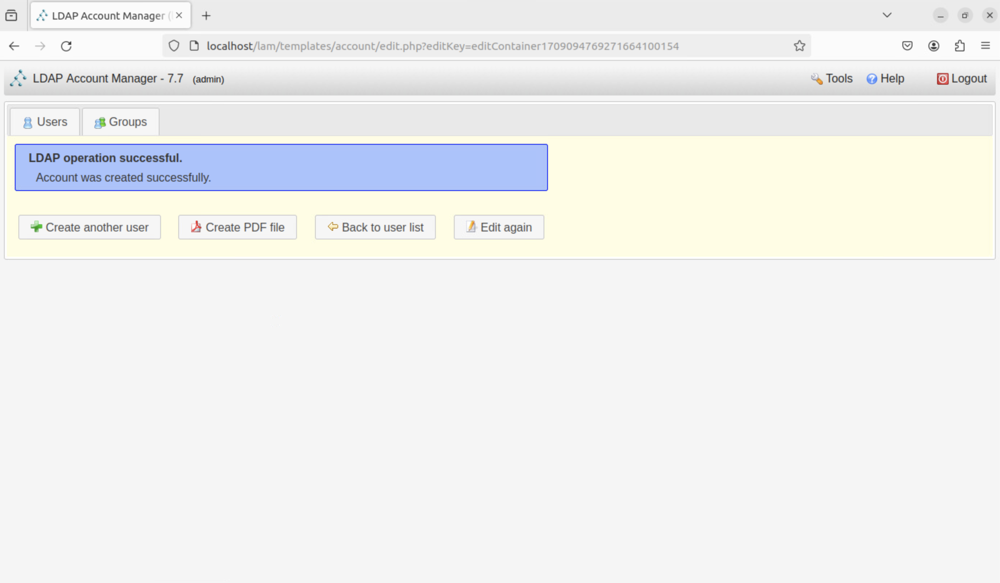

ユーザーが追加出来ているかは、例えば、下記のコマンドで確認できます。
（testuserを追加した場合）

.. code-block:: bash

   sudo su - testuser

SLURMを用いたジョブの投入方法
---------------------------------------------------------------

ここでは、SLURMを用いたジョブの投入方法について記載します。

例として以下のようなコードを実行する場合を考えます。

.. code-block:: c

   #include <unistd.h>
   #include <stdio.h>

   int main(){
       int i;
       for(i=0; i<10; i++){
           sleep(10);
           printf("loop no %i\n", i);
       }

       return 0;
   }

このコードをtest.cという名前で保存し、コンパイルします。

.. code-block:: bash

   gcc test.c

これでa.outという実行ファイルが生成されます。

次に、ジョブスクリプトを作成します。

.. code-block:: bash

   #!/bin/bash
   #SBATCH --job-name=test_job
   #SBATCH --ntasks=1
   #SBATCH --nodes=1
   #SBATCH --time=00:01:00
   #SBATCH --partition=debug
   #SBATCH --output=test_job.out

   echo "Start job"
   date
   ./a.out
   date
   echo "End job"

このジョブスクリプトをtest_job.shという名前で保存します。

SLURMのジョブを投入するには、sbatchコマンドを用います。

.. code-block:: bash

   sbatch test_job.sh

上記を実行すると下記のようにジョブIDが表示されます。

.. code-block:: none

   Submitted batch job 6

ジョブの状態を確認するには、squeueコマンドを用います。

.. code-block:: bash

   squeue

これを実行すると、ジョブが実行されている場合下記のように出力されます。

.. code-block:: none

   JOBID PARTITION     NAME     USER ST       TIME  NODES NODELIST(REASON)
       6     debug test_job  mdxuser  R       0:05      1 ubuntu-2204-test

ジョブを削除する場合は、scancelコマンドを用います。
引数にジョブIDを指定してください。

.. code-block:: bash

   scancel 6

さて、上記のジョブが終了すれば、test_job.outというファイルが生成されます。
（これは、test_job.sh内の #SBATCH --output=test_job.out に対応しています）
内容は下記のようになります。

.. code-block:: none

   Start job
   Tue Mar  5 15:33:50 JST 2024
   loop no 0
   loop no 1
   loop no 2
   loop no 3
   loop no 4
   loop no 5
   loop no 6
   loop no 7
   loop no 8
   loop no 9
   Tue Mar  5 15:34:00 JST 2024
   End job

これで、ジョブの投入から終了までの一連の流れが完了しました。