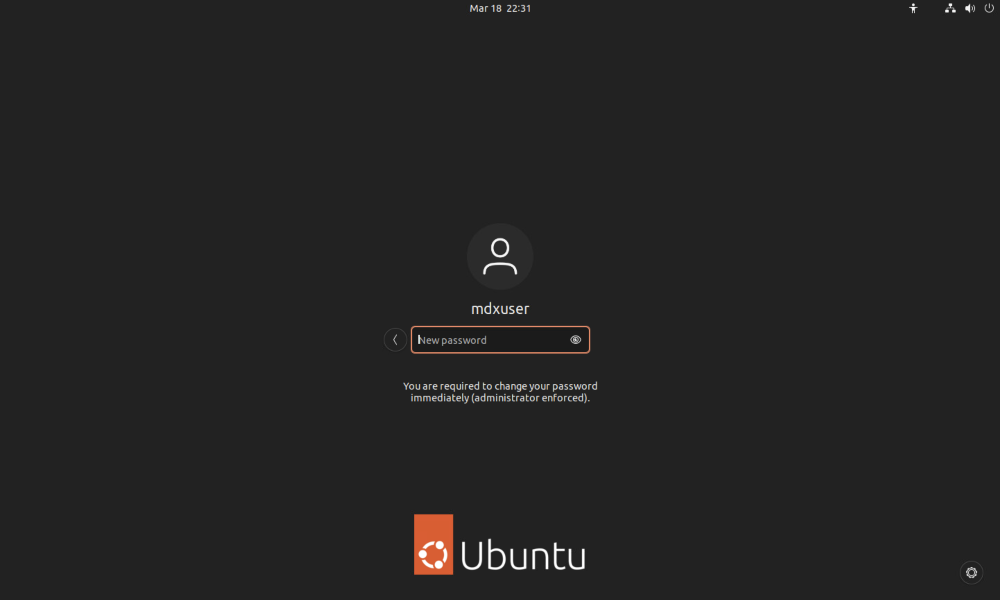
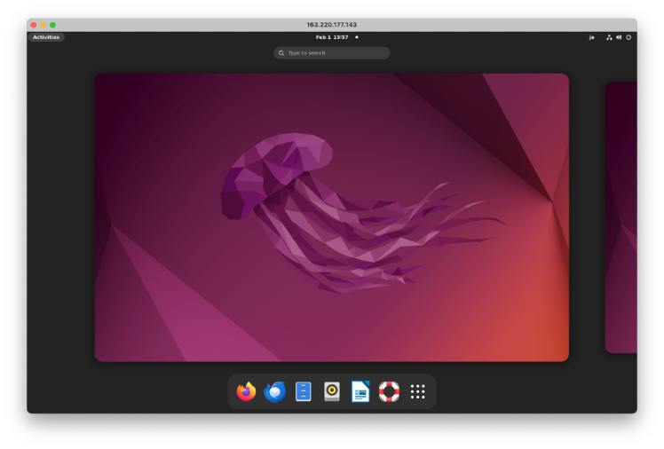
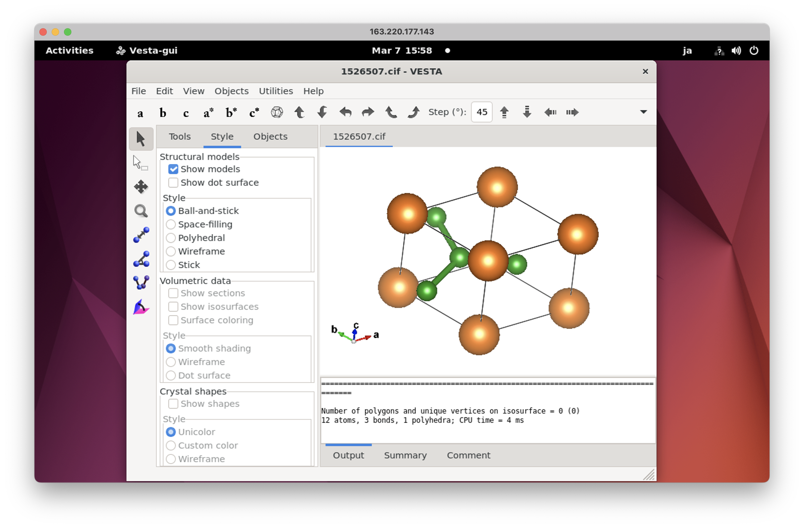

.. 操作マニュアル documentation master file, created by
   sphinx-quickstart on 2024.2.22.
   You can adapt this file completely to your liking, but it should at least
   contain the root `toctree` directive.

利用マニュアル
===================================================================================

.. toctree::
   :maxdepth: 3
   :caption: Contents:

.. _chapter02:

MateriAppsLive!テンプレートについて
===================================================================================

概要
---------------------------------------------------------------

MateriApps LIVE!は計算物質科学アプリケーション、可視化ツールなどが手軽に利用出来るLinuxシステムで、
Debianベースのovaファイルとして提供されています。
また、MateriApps LIVE!のリポジトリを登録する事で、Ubuntuからも利用可能です。

MateriApps LIVE!に関する詳細は下記HPよりご覧になれます。

http://cmsi.github.io/MateriAppsLive/

本テンプレートは、MateriApps LIVE!に含まれるアプリケーションが動くUbuntu環境を
mdx利用者に提供します。システムの概要は下記の通りです。

本書では、 :ref:`vm_create` で仮想マシンの作成方法、 :ref:`vm_usage` で利用方法、
:ref:`remote_setting` でリモートデスクトップの設定方法、 :ref:`remote_connection` にて、
リモートデスクトップの接続方法について説明しています。

   
バージョン情報
---------------------------------------------------------------

本マニュアルはmaliveのバージョン4.1、mdx_image version 2024.3に対応しています。

利用できる計算物質科学アプリケーションについて
---------------------------------------------------------------

MateriAppsLive!テンプレートでは以下の計算物質科学アプリケーションが利用できます。

- DCore
- FermiSurfer
- HPhi
- mVMC
- OpenMX
- Quantum ESPRESSO
- RESPACK
- VESTA
- Xcrysden
- ALPS
- GAMESS
- LAMMPS
- VMD（※準備中）
- SALMON
- AkaiKKR
- SMASH
- CONQUEST
- Abinit
- xTAPP
- cp2k
- C-TOOLS

MateriAppsLive！が実行される仮想マシンについて
---------------------------------------------------------------

MateriAppsLive!テンプレートでdeployされる仮想マシンの仕様は以下になります。

- ubuntu22.04
- Lustre_client: 2.14.0_ddn93
- Mellanox OFED driver: 5.8-3.0.7.0
- Nvidia driver: 535
- CUDA toolkit: 11.8

.. _vm_create:

MateriAppsLive!テンプレートによる仮想マシン作成方法
===================================================================================

仮想マシンの作成手順
-------------------------------------------------------------------------------------------

1. 上部メニューから[仮想マシン]をクリックします。

2. サイドメニューから[デプロイ]をクリックします。

3. 表示された仮想マシンのテンプレート一覧から、[MateriAppsLive-ubuntu-2204]のテンプレートを選択しリスト上部の[デプロイ]をクリックします。

4. ハードウェアのカスタマイズ画面にて必要事項を入力します。入力が完了したら[デプロイ]をクリックします。

デプロイ時の設定項目
-------------------------------------------------------------------------------------------

通常のデプロイ時と同じですが、パック数と仮想ディスクについては下記の設定が推奨されます。

.. csv-table::
  :header-rows: 1
  :widths: 4, 6

  項目 , 説明
  パック数 , 32以上
  仮想ディスク(GB), 80以上

.. _vm_usage:

利用方法
===================================================================================

パスワードの設定
-------------------------------------------------------------------------------------------

MateriApps LIVE!をリモート接続などで使用する場合、デスクトップのパスワードを設定しておく必要があります。
パスワードは最初のログイン時に設定します。ユーザーポータル画面の仮想マシンタブで
MateriAppsLive! VMを選択し、「CONSOLE」をクリックしてください。

立ち上がったウィンドウで、パスワードを設定してください。
こちらのパスワードはリモートデスクトップ接続時にも使用します。

仮想マシンへのアクセス方法
-------------------------------------------------------------------------------------------
デプロイ時に設定されていたログインユーザ名およびデプロイ時に入力した公開鍵とペアになる秘密鍵を用いて仮想マシンにログインします。
アクセス時は自身のターミナルから仮想マシンのアドレスにsshで接続してください。

仮想マシンには、SSH以外にリモートデスクトップによる接続も可能です。
リモートデスクトップ接続については :ref:`remote_setting` および :ref:`remote_connection` 
を参照してください。

MateriAppsLive!によってインストールされるアプリケーションの利用方法
-------------------------------------------------------------------------------------------
各アプリケーションの利用方法についてはMateriAppsLive!公式マニュアルをご参照ください。

https://github.com/cmsi/MateriAppsLive/wiki/ApplicationsAndTools

MateriAppsLive!へのリモート接続の方法
-------------------------------------------------------------------------------------------

ここでは、mdx環境でのMateriAppsLive! VMにリモートデスクトップを用いて接続するに当たって必要な
mdxユーザーポータルでの事前設定およびリモート接続方法（Windows, Macから接続する場合）
について説明しています。

.. _remote_setting:

事前設定
~~~~~~~~~~~~~~~~~~~~~~~

MateriAppsLive! VMに接続するためにはmdxでのネットワーク設定が必要となります。
以下、ACLとDNATの設定について記載します。

**ACLの設定**

mdxユーザーポータルに接続後、「ネットワーク」タブを選択し、左側のメニューの「ACL」をクリックしてください。
MateriAppsLive! VMを作成したプロジェクトを選択し、IPv4の「+ RECORD」ボタンをクリックしてください。

出てきた「Recordの追加」Windowで、下記の設定をしてください。

.. code-block:: text

    プロトコル: TCP
    Srcアドレス: xxx.xxx.xxx.xxx (1)
    SrcPrefix長: 24
    Srcポート: Any
    Dstアドレス: yyy.yyy.yyy.yyy (2)
    DstPrefix長: 32
    Dstポート: 3389

1. お使いの環境のグローバルIPに基づいて入力してください。

   例: グローバルIPが123.456.789.123の場合、123.456.789.0としてください。

2. MAlive VMのIPv4アドレスを入力してください。

   この情報は、「仮想マシン」タブの「コントロール」を選択した時に表示される仮想マシン名を選択した時に、
   画面右側サマリの「サービスネットワーク 1」「IPv4アドレス」に表示されます。

上記で プロトコル:TCP のRecordを追加しました。加えて プロトコル:UDP のRecordも追加します。
方法は設定画面で「プロトコル」の部分でUDPを選択する以外は同じです。

これでmdxユーザーポータルでの設定は完了です。

**DNATの設定**

ここでは、MateriAppsLive! VMにグローバルアドレスを振り分けます。

「DNATの追加」ウィンドウで、「ネットワーク」タブの「DNAT」をクリックの上、
「+ DNAT」ボタンをクリックしてください。
「転送元グローバルIPv4アドレス」はプルダウンメニューから選択してください。
このグローバルアドレスはリモート接続時に使用します。
「セグメント」はMAlive VMを作成したプロジェクトを選択し、「転送先プライベートIPアドレス」には
MateriAppsLive! VMのIPv4アドレス（[ACLの設定]に出てくるのと同じもの）を入力してください。

これらの設定が終わったら、「追加」ボタンをクリックしてください。DNATの設定はこれで終了です。

.. _remote_connection:

リモート接続方法
~~~~~~~~~~~~~~~~~~~~~~~

**Windowsからのリモート接続**

Windowsに標準で搭載されている「リモート デスクトップ接続」のアプリを用います。
起動後、「オプションの表示」をクリックし、「コンピュータ」欄にMateriAppsLive! VMのグローバルIP、
「ユーザー名」にユーザー名（デフォルトではmdxuser）を入れ、接続をクリックしてください。

下記の画面が出た場合は、「はい」をクリックしてください。

ログイン画面が立ち上がります。

このウィンドウで、passwordにMateriAppsLive! VMのログインパスワードを記入の上、
OKをクリックしてください。

リモートデスクトップが立ち上がります。

この後はメニューからターミナル等アプリケーションを選択して起動してください。
例えば結晶構造可視化ソフトウェアVESTAを起動し、結晶構造を表示すると下記のようになります。

ログイン時に以下のような画面が出た場合は再度MateriAppsLive! VMのパスワードを入力しEnterするか、
Cancelをクリックしてください。

**Macからのリモート接続**

まず、リモートデスクトップクライアントをインストールしてください。
ここでは、「Microsoft Remote Desktop」を用います。

「Microsoft Remote Desktop」のインストールはMacのApp Storeから行います。
MacのApp Storeにアクセスし、「Remote Desktop」で検索すると、
「Microsoft Remote Desktop」が出てくるかと思います。選択してインストールしてください。
（無料で利用可能です）

「Microsoft Remote Desktop」をインストールしたら、起動し、
上部にある「+」ボタンをクリックし、「Add PC」を選択してください。

「Add PC」ウィンドウで「PC name」にMAlive VMのグローバルアドレスを入力してください。
また、「User account」のプルダウンメニューから「Add User Account…」を選択し、
立ち上がった「Add a User Account」ウィンドウでUserName（デフォルトではmdxuser）を記載の上、
右下「Add」ボタンをクリックしてください。Passwordは空欄でかまいません。
ここで作成したアカウントを「User account」で選択してください。
その後、「Add PC」ウィンドウの右下「Add」ボタンをクリックしてください。
ここまででマシンの設定は完了です。

マシン設定が完了すれば、Microsoft Remote Desktopの画面に追加したマシンが表示されます。
これをダブルクリックすればMateriAppsLive!へリモート接続します。

このウィンドウで、passwordにMateriAppsLive! VMのログインパスワードを記入の上、OKをクリックしてください。

リモートデスクトップが立ち上がります。

この後はメニューからターミナル等アプリケーションを選択して起動してください。
例えば結晶構造可視化ソフトウェアVESTAを起動し、結晶構造を表示すると下記のようになります。

ログイン時に以下のような画面が出た場合は再度MateriAppsLive! VMのパスワードを入力し
Enterするか、Cancelをクリックしてください。

注意する点
~~~~~~~~~~~~~~~~~~~~~~~

別途デスクトップ環境にログインしている場合（mdxのCONSOLE経由でログインしている場合など）、
リモートデスクトップが起動できないようです。
その場合は現在ログインしている環境からログアウトした上でリモートログインを試してください。